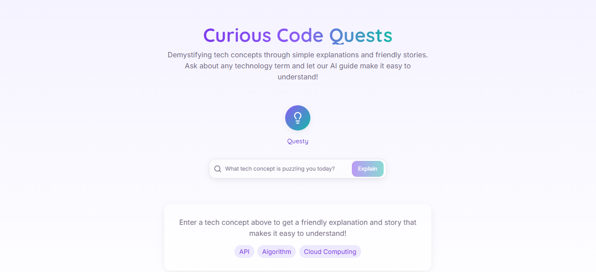
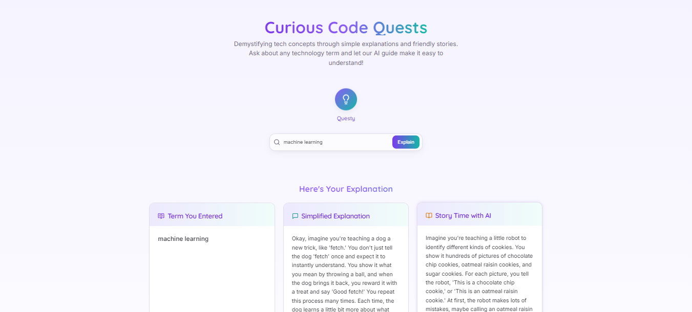

# 🚀 Curious Code Quests

_“Turning complex tech concepts into curious, kid-like stories.”_

Curious Code Quests is a **React + Node.js + Gemini API** powered web app that simplifies technical concepts through fun, engaging, and intuitive storytelling. Whether you're a curious beginner or a seasoned developer needing a quick refresher—this app explains APIs, algorithms, and more like never before.

---

## 🧠 Features

- 🤖 **AI-Powered Explanations** using Gemini API  
- 📚 **Story-based Learning**: Every concept comes with a metaphorical story  
- 🎨 **Modern UI** built with React and Tailwind CSS  
- 🧪 **Test with Thunder Client** or other REST tools  
- ⚡️ Fast, responsive, and minimal  

---

## 💠 Tech Stack

| Frontend            | Backend            | AI Integration         |
|---------------------|--------------------|-------------------------|
| React + TypeScript  | Node.js + Express  | Google Gemini API      |
| Tailwind CSS        | RESTful API        | @google/generative-ai  |

---

## 📸 Screenshots

| Concept Input        | AI Character         | Explanations         |
|----------------------|----------------------|-----------------------|
|  |  |

---

## ⚙️ Local Setup

### 1. Clone the Repo

### 2. Install Dependencies

```bash
# For frontend
npm install

# For backend
cd backend
npm install

```

### 3. Add Your Gemini API Key

Create a .env file in the backend folder:

```env

  GEMINI_API_KEY=your_google_generative_ai_key_here

```
### 4. Run the App

``` bash

# Start the frontend
npm run dev

# Start the backend
cd backend
npm run start

```

### 🤝 Contributions

Got a cool idea or new concept you'd like explained? Open a PR or issue!
This project is open for contributions, improvements, and educational collabs.

### 🧠 Inspiration

This project was born from the idea that everyone learns better through stories.
Why make tech intimidating when we can make it curious, creative, and fun?
